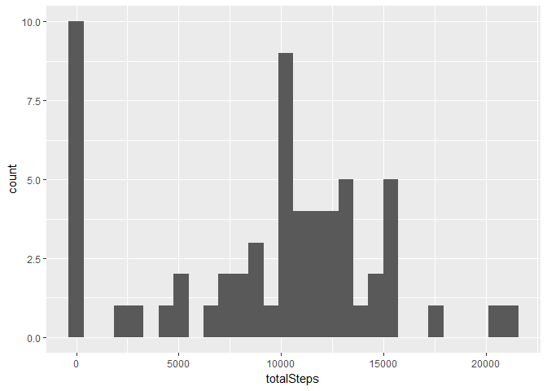
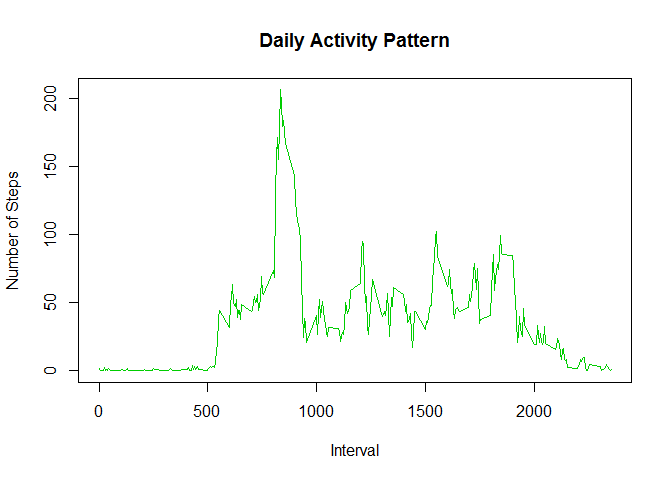
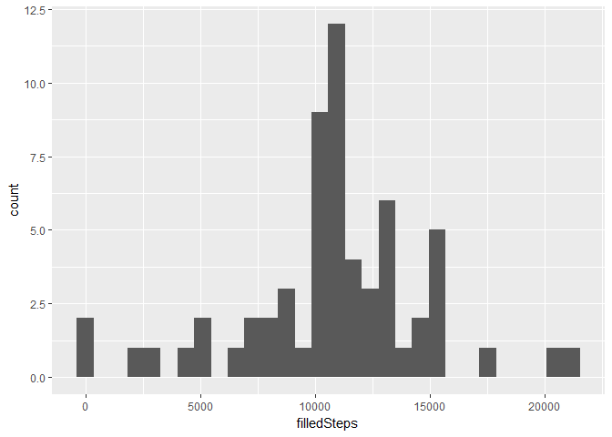

# Reproducible Research Project 1
A. C.  
July 11, 2017  

This is the report for the assignment of week 2, Reproducible Reseach course. The purpose of the study is to investigate the relationship between different time intervals and number of steps the subjects took.

## Loading the Data


```r
knitr::opts_chunk$set(
  fig.path = "figure/"
)

library(ggplot2)
library(lattice)
library("data.table")

activityData <-data.table::fread(input = "data/activity.csv")
```

## What is mean total number of steps taken per day?


```r
totalSteps <- with(activityData, tapply(steps, date, sum, na.rm = TRUE))
qplot(totalSteps)
```

```
## `stat_bin()` using `bins = 30`. Pick better value with `binwidth`.
```

<!-- -->

```r
summary(totalSteps)
```

```
##    Min. 1st Qu.  Median    Mean 3rd Qu.    Max. 
##       0    6778   10395    9354   12811   21194
```
The mean of the total number of steps: 9354
The median of the total number of steps: 10395

## What is the average daily activity pattern?


```r
##Filter out all NA data
cleanData <- na.omit(activityData)

##Aggregate the intervals and steps, applying average function
actSteps <- aggregate(cleanData$steps, list(as.numeric(cleanData$interval)), FUN="mean")

names(actSteps) <- c("interval","mean")

##Plot the time series
plot(actSteps, type="l", xlab="Interval", ylab="Number of Steps", main="Daily Activity Pattern", col=3)
```

<!-- -->

The 5-minute interval, on average across all the days in the dataset, contains the maximum number of steps is:


```r
actSteps$interval[ which.max(actSteps$mean)]
```

```
## [1] 835
```

##Imputing missing values

The total number of missing values in the dataset is:

```r
sum(is.na(activityData$steps)) 
```

```
## [1] 2304
```

Use the daily mean to fill up missing data:

```r
##Get the intervals with missing steps
missingSteps <- which(is.na(activityData$steps))

imputedData <-activityData

##Fill up each interval of missing steps with its daily mean
for (i in 1:nrow(imputedData)) {
  if (is.na(imputedData$steps[i])) {
    interval_value <- imputedData$interval[i]
    for (j in 1:nrow(actSteps)){
      if (actSteps$interval[j] == interval_value)
          steps_value <- actSteps$mean[j]
   }
    imputedData$steps[i] <- steps_value
  }
}
```

The histogram of the total number of steps taken each day after data imputing:

```r
filledSteps <- with(imputedData, tapply(steps, date, sum, na.rm = TRUE))
qplot(filledSteps)
```

```
## `stat_bin()` using `bins = 30`. Pick better value with `binwidth`.
```

<!-- -->

```r
summary(filledSteps)
```

```
##    Min. 1st Qu.  Median    Mean 3rd Qu.    Max. 
##      41    9819   10766   10766   12811   21194
```

The mean of the total number of steps: 10766
The median of the total number of steps: 10766

The mean and median of imputed data is different compared with the original data. The mean and median of imputed data is the same.

##Are there dierences in activity patterns between weekdays and weekends?


```r
weekdays <- c("Monday", "Tuesday", "Wednesday", "Thursday", 
              "Friday")
imputedData$dow = as.factor(ifelse(is.element(weekdays(as.Date(imputedData$date)),weekdays), "Weekday", "Weekend"))

stepsbyInterval <- aggregate(steps ~ interval + dow, imputedData, mean)

xyplot(stepsbyInterval$steps ~ stepsbyInterval$interval|stepsbyInterval$dow, main="Average Steps per Day by Interval",xlab="Interval", ylab="Steps",layout=c(1,2), type="l")
```

<!-- -->
